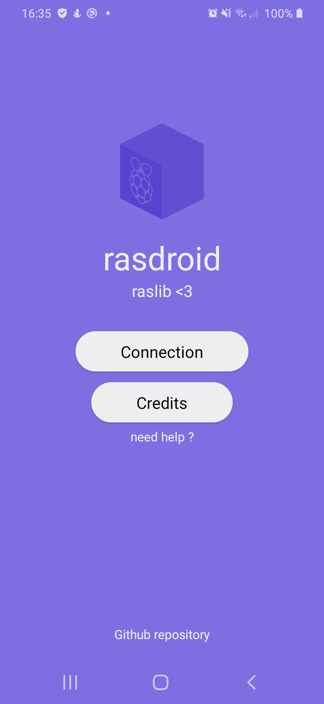
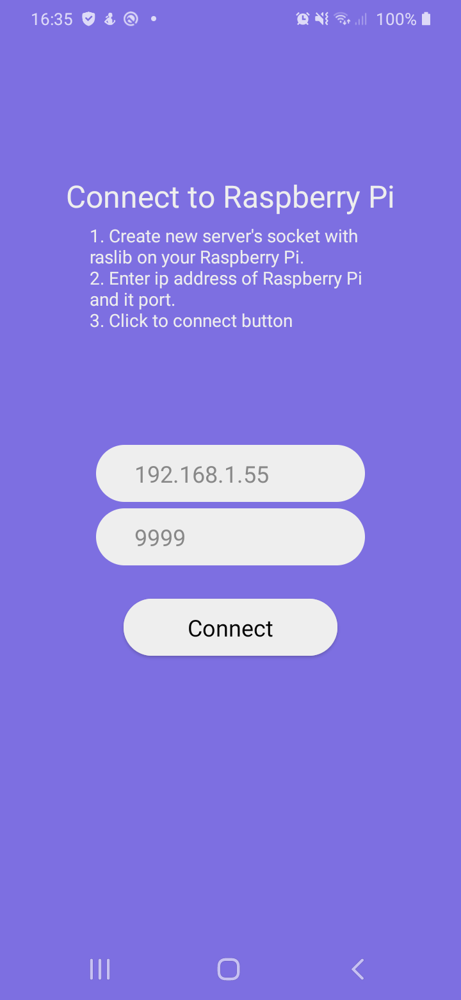
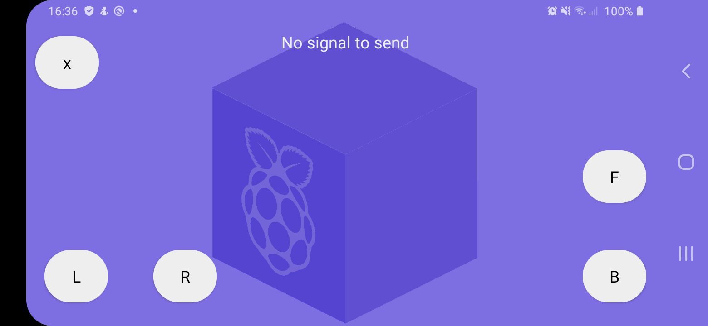

# rasdroid
Android app written in Java. Contribution of raslib

### Start
1. [Make a server socket with raslib](https://github.com/antoninhrlt/raslib/blob/main/README.md#complete-example) (change ip address for your Raspberry's ip)
2. Enter connection informations after clicked on "Connection" at main menu
3. Click to "Connect"
4. Enjoy !

### Signal sent
- forward: 2 
- backward: 3
- left: 4
- right: 5

### Screenshots
  
